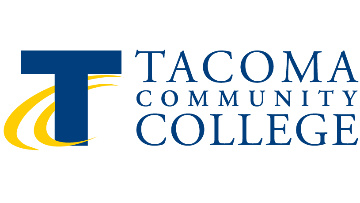

# CS 142 — Spring 2026 Example Code Repository

This repository contains the example code written during class each week.
To view the source code for a given week, click on the folder for that week (e.g. `Week1`).
Code is added throughout the quarter as we cover each topic in class.

---

**Class Time:** Tuesdays and Thursdays 1:30pm – 3:30pm  
**Class Location:** Building 16 Room 110

## Resources for Help

### 1. Office Hours

Office hours are held **Tuesdays before class from 12:30pm to 1:30pm** in Building 16 Room 110.

### 2. Tutoring

**SEM Tutoring Center** — Building 19 Room 22 (south end of building 19)

| Day               | Hours                             |
| ----------------- | --------------------------------- |
| Monday – Thursday | 9:00am – 5:00pm                   |
| Friday            | 9:00am – 3:00pm                   |
| Weekends          | Closed (online options available) |

**SEMTC Satellite — MESA Center, Building 15**

| Day               | Hours           |
| ----------------- | --------------- |
| Monday – Thursday | 9:00am – 7:00pm |
| Friday            | 9:00am – 3:00pm |

### 3. Email

Contact me via Canvas message. I will respond within 24 hours Mon–Thurs. I check messages over the weekend but cannot guarantee a 24-hour response.

> **Note on code questions:** Please send the actual code as an attachment or paste it into the message body. Do not send a screenshot — I cannot run a picture.
